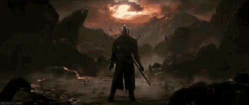
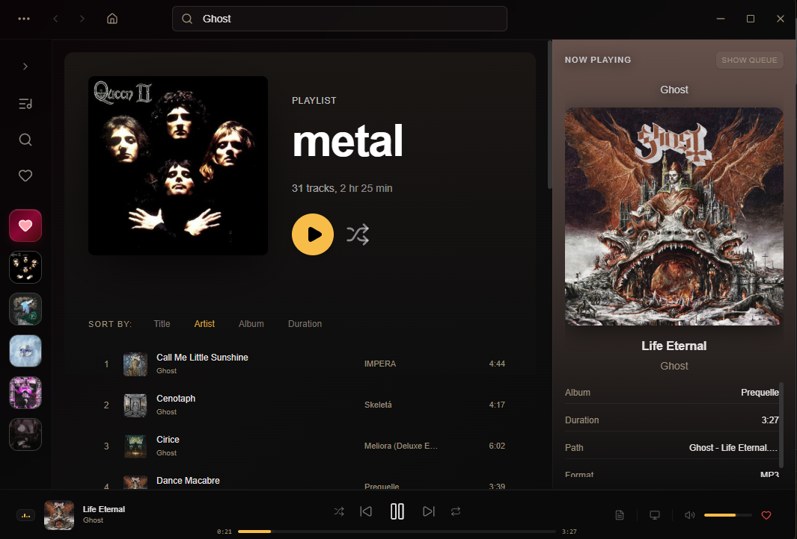

<p align="center">
  
</p>

<h1 align="center">Ashen</h1>

<p align="center">
  
  
  
  
</p>

<p align="center">
  <i>A gothic-rock music player forged in shadow and gold.</i>
</p>

<p align="center">
  
</p>

---

### About

Ashen is a desktop music player built with **Tauri v2**, **React**, and **Rust**. A gothic-rock aesthetic -- deep burgundy-black gradients, dark gold accents (`#f7bd48`), and rose-tinted highlights.

Every surface is `backdrop-blur-xl` with `border-white/[0.04]`, ultra-thin borders that barely hold the light.

### Features

- **Local music playback** -- MP3, FLAC, WAV, M4A, OGG, and more
- **Folder-based library** -- automatically scans your music directories with album art extraction
- **Smart queue** -- shuffle, repeat (all/one), and ordered playback with a queue panel
- **Favorites** -- save and revisit tracks with a dedicated gradient-styled button
- **Recent playlists** -- MRU list with cover stacks, persisted to localStorage
- **Track metadata** -- artist, album, duration, format, path, and embedded cover art
- **Loudness normalization** -- backend-powered EBU R128 analysis (LUFS)
- **Search** -- filter your library by title, artist, or album
- **Resizable panels** -- collapsible sidebar, draggable footer, and a resizable right panel

### Tech

| Layer | Stack |
|---|---|
| Frontend | React 19, TypeScript, Tailwind CSS, Vite |
| Backend | Rust, Tauri v2, `lofty` (metadata), `reqwest` |
| APIs | Yandex Music (artist search) |
| Audio | loudness-rs (EBU R128), Web Audio API progress |
| Icons | lucide-react |

### Build

```bash
git clone https://github.com/JDaxmaut/ashen-player.git
cd ashen-player
npm install
npm run tauri dev    # dev mode
npm run tauri build  # production build
```

---

<p align="center">
  
</p>
